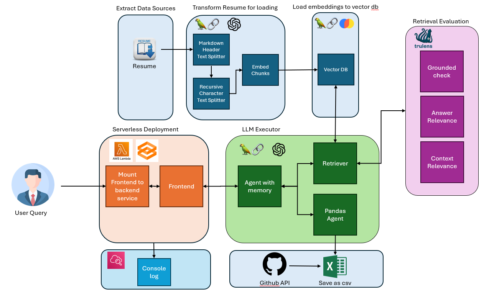

# Curriebot

Meet Curriebot, your personal career companion! Curriebot is here to help you navigate through my professional journey/"Curri"culum vitae, answering all your questions about my resume or personal projects. Whether you're curious about the details of my project or want insights into my skill set, Curriebot is ready to chat. Friendly and knowledgeable, Curriebot makes learning about my professional life both easy and enjoyable. Let's get the conversation started!

## Demo

https://github.com/pgplarosa/curriebot/assets/67182415/41bbeb3e-8e0c-49e9-bc8a-ed4d86e49dae

## Solution Design



## Project tree

 * [docker-lambda-aws](./docker-lambda-aws)
   * [image](./docker-lambda-aws/image)
     * [requirements.txt](./docker-lambda-aws/image/requirements.txt)
     * [src](./docker-lambda-aws/image/src)
       * [config.py](./docker-lambda-aws/image/src/config.py)
       * [curriebot.py](./docker-lambda-aws/image/src/curriebot.py)
       * [main.py](./docker-lambda-aws/image/src/main.py)
       * [retriever.py](./docker-lambda-aws/image/src/retriever.py)
   * [lib](./docker-lambda-aws/lib)
     * [docker-lambda-aws-stack.ts](./docker-lambda-aws/lib/docker-lambda-aws-stack.ts)
 * [notebooks](./notebooks)

Most of the files in the path are the default settings of AWS CDK. Above are the files that you might want to look at if your are exploring the functionality of the chatbot.

**docker-lambda/image/** - contains all the source codes, requirements, and dockerfile
- requirements.txt - list of packages used in this project 
- src/config.py - contains all the config parameters and path. might want to update when using your own data
- src/curriebot.py - llm executor
- src/main.py - frontend service
- src/retriever.py - retriever

**docker-lambda/lib/docker-lambda-aws-stack.ts** - update based on your requirements when deploying to AWS lambda

**notebooks/**
- all notebooks used for the experimentation of the project from data ingestion to frontend
- Note: update the paths if needed and run etl.ipynb and github_scraper.ipynb if you want to run this in your own data.

## Usage

- **if you want to chat with curriebot with my resume and github, it is currently deployed in AWS lambda. Please use the following link and open it to your browser:**
```
https://24mi62ygm32hhfj6djwx7zzlwe0uynqb.lambda-url.us-east-1.on.aws/
```
Note: Initial visit to the link might take few seconds to setup before you can actually work on it.

- **if you want to chat with your own data, follow the steps below:**
1. Pre-requisites: Python, npm, and docker are installed
2. Install packages in your environment: 
```
pip install curriebot/docker-lambda-aws/requirements.txt
```
3. Update the paths and parameters (e.g. resume, github profile, etc.) and run notebooks/etl.ipynb and notebooks/github_scraper.ipynb 
4. Run the following command in the curriebot folder:
```
cd docker-lambda/image
docker build --no-cache -t  docker-image:test .
cd ..
sudo cdk deploy
``` 
5. Use the link that is going to be produced by AWS Lambda

## Authors

* **Patrick La Rosa**
    * [Github](https://github.com/pgplarosa)
    * [LinkedIn](https://www.linkedin.com/in/patricklarosa)
